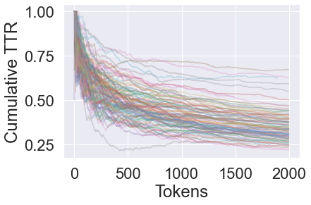
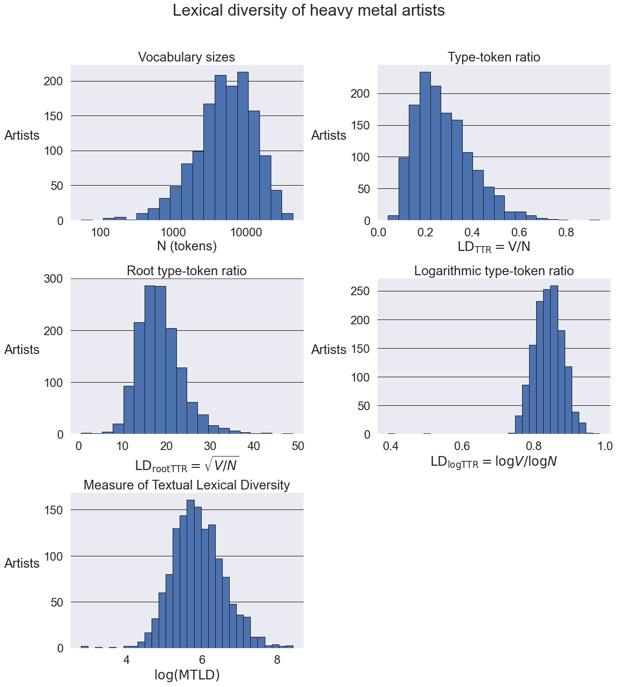
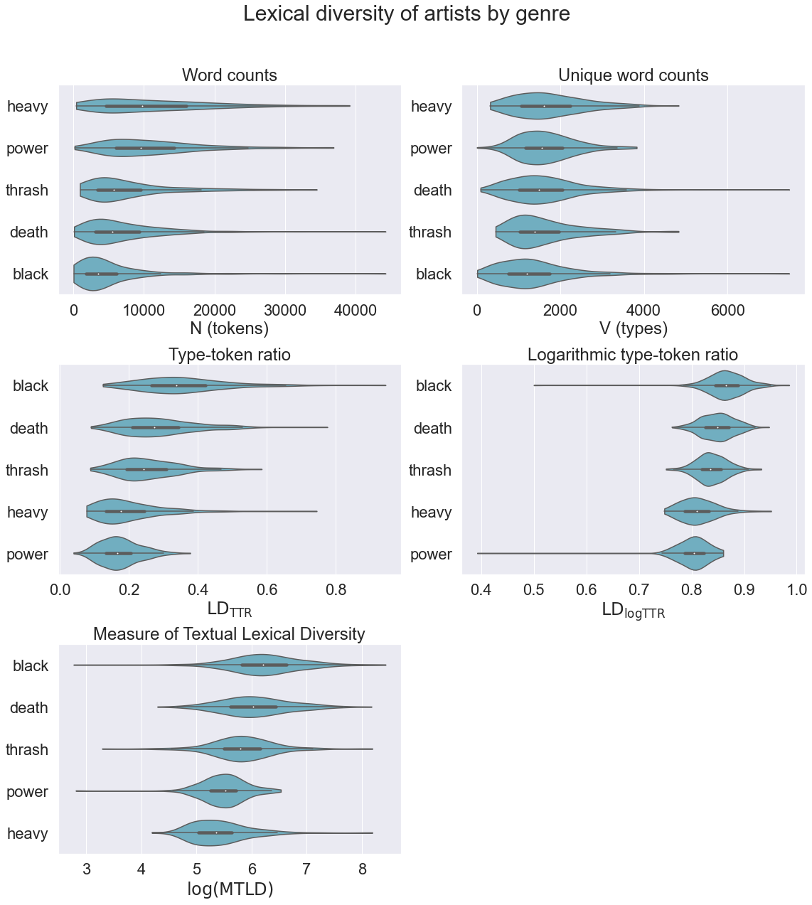
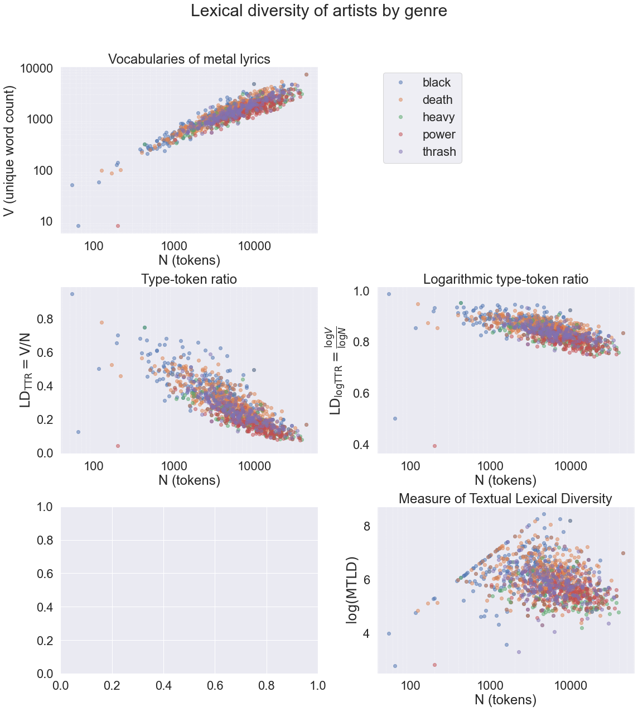
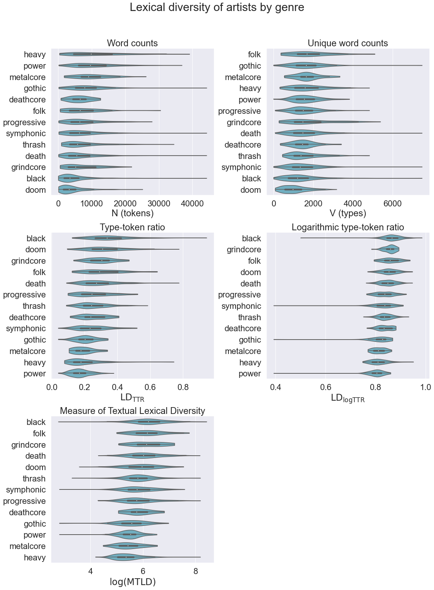

# Song lyrics exploration - Part 2: Lexical diversity

This part explores the [lexical diversity](https://en.wikipedia.org/wiki/Lexical_diversity) of different metal genres and bands. A few different methods are used to quantify lexical diversity in order to answer the question of which genre or band has the most complex vocabulary.


```python
import re
import numpy as np
import pandas as pd
import matplotlib.pyplot as plt
from matplotlib.ticker import ScalarFormatter
plt.style.use('seaborn')
import seaborn as sns
sns.set(font_scale=2)
from nltk.corpus import words as nltk_words

from nlp import tokenize
```

# Loading and pre-processing data


```python
def get_genres(data):
    columns = [col for col in data.columns if 'genre_' in col]
    genres = [re.sub(r"^genre\_", "", col) for col in columns]
    return genres, columns


def get_bands(data):
    genres, genre_cols = get_genres(data)
    # Combine songs from same band
    band_genres = data.groupby('band_name')[genre_cols].max()
    band_lyrics = data.groupby('band_name').song_darklyrics.sum()
    bands = pd.concat((band_genres, band_lyrics), axis=1)
    bands.columns = genres + ['lyrics']
    bands['words'] = bands.lyrics.apply(tokenize)
    return bands


def get_songs(data):
    genres, genre_cols = get_genres(data)
    songs = data[['band_name', 'song_name'] + genre_cols + ['song_darklyrics']].copy()
    songs.columns = ['band_name', 'song_name'] + genres + ['lyrics']
    songs['words'] = songs.lyrics.apply(tokenize)
    return songs
```


```python
df = pd.read_csv('songs-10pct.csv')
df_bands = get_bands(df)
df_songs = get_songs(df)
```

# Lexical diversity measures

One simple approach to quantifying lexical diversity is to divide the number of unique words (types, $V$) by the total word count (tokens, $N$). This type-token ratio or TTR is heavily biased toward short texts, since longer texts are more likely to repeat tokens without necessarily diminishing complexity. A few ways exist for rescaling the relationship to reduce this bias; for this notebook the root-TTR and log-TTR are used:

$$
\begin{split}
&LD_{TTR} &= \frac{V}{N} &\hspace{1cm} (\textrm{type-token ratio})\\
&LD_{rootTTR} &= \frac{V}{\sqrt{N}} &\hspace{1cm} (\textrm{root type-token ratio})\\
&LD_{logTTR} &= \frac{\log{V}}{\log{N}} &\hspace{1cm} (\textrm{logarithmic type-token ratio})\\
\end{split}
$$

More sophisticated approaches look at how types are distributed in the text. The bluntly named Measure of Textual Lexical Diversity (MTLD), described by [McCarthy and Jarvis (2010)](https://doi.org/10.3758/BRM.42.2.381), is based on the mean length of token sequences in the text that exceed a certain TTR threshold. The algorithm begins with a sequence consisting of the first token in the text, and iteratively adds the following token, each time recomputing the TTR of the sequence so far. Once the sequence TTR drops below the pre-determined threshold, the sequence ends and a new sequence begins at the next token. This continues until the end of the text is reached, at which point the mean sequence length is computed. The process is repeated from the last token, going backwards, to produce another mean sequence length. The mean of these two results is the final MTLD figure.

Unlike the simpler methods, MTLD has a tunable parameter. The TTR threshold is chosen by the authors to be 0.720, which is approximately where the cumulative TTR curves for texts in the Project Gutenburg Text Archives reached a point of stabilization. The same can be done with the DarkLyrics data by plotting cumulative TTR values for a large number of bands and identifying the point of stabilization. This cannot be done with single-song lyrics since refrains in the lyrics heavily warp the cumulative TTR curves, such that most never stabilize. Unfortunately even when looking at band lyrics, the cumulative TTR does not stabilize very well, as the curves seem to continue decaying well into the thousands of tokens. However one can roughly identify a point of stabilization somewhere around a TTR of 0.5, occuring at about 200 tokens, so this is used as the threshold for MTLD.


```python
def TTR(x):
    return len(set(x)) / len(x)

def cumulative_TTR(words):
    out = [TTR(words[: i + 1]) for i in range(len(words))]
    return out

for i in range(0, 1000, 10):
    plt.plot(cumulative_TTR(df_bands.iloc[i].words[:2000]), alpha=0.3)
plt.xlabel('Tokens')
plt.ylabel('Cumulative TTR')
plt.show()
```





```python
def MTLD_forward(words, threshold, verbose=False):
    factor = 0
    segment = []
    i = 0
    while i < len(words):
        segment.append(words[i])
        segTTR = TTR(segment)
        if verbose:
            print(i, segment, factor, segTTR)
        if segTTR <= threshold:
            segment = []
            factor += 1
        i += 1
    if len(segment) > 0:
        factor += (1.0 - segTTR) / (1.0 - threshold)
        if verbose:
            print(segment, factor)
    factor = max(1.0, factor)
    mtld = len(words) / factor
    return mtld


def MTLD(words, threshold=0.720, verbose=False):
    if len(words) == 0:
        return 0.0
    forward = MTLD_forward(words, threshold, verbose=verbose)
    reverse = MTLD_forward(words[::-1], threshold, verbose=verbose)
    return 0.5 * (forward + reverse)
```


```python
def get_lexical_diversity(data):
    N = data.words.apply(len)
    V = data.words.apply(lambda x: len(set(x)))
    data['N'] = N
    data['V'] = V
    data['TTR'] = V / N
    data['rootTTR'] = V / np.sqrt(N)
    data['logTTR'] = np.log(V) / np.log(N)
    data['mtld'] = data.words.apply(MTLD, threshold=0.5)
    data['logmtld'] = np.log(data['mtld'])
    return data[data.N > 0]
```


```python
df_bands = get_lexical_diversity(df_bands)
df_songs = get_lexical_diversity(df_songs)
```

    C:\Users\philippe\Anaconda3\envs\ml\lib\site-packages\pandas\core\series.py:726: RuntimeWarning: divide by zero encountered in log
      result = getattr(ufunc, method)(*inputs, **kwargs)
    

# Histograms


```python
def plot_histograms(data):
    fig, axes = plt.subplots(3, 2, figsize=(16, 18))
    fig.suptitle("Lexical diversity of heavy metal artists", fontsize=30)
    axes = axes.flatten()

    ax = axes[0]
    logNmin, logNmax = np.log10(data.N.min()), np.log10(data.N.max())
    logbins = np.logspace(logNmin, logNmax, 20)
    data.N.hist(bins=logbins, edgecolor='k', ax=ax)
    ax.set_xscale('log')
    ax.set_title("Vocabulary sizes")
    ax.set_xlabel("N (tokens)")
    for axis in [ax.xaxis, ax.yaxis]:
        axis.set_major_formatter(ScalarFormatter())

    ax = axes[1]
    data.TTR.hist(bins=20, edgecolor='k', ax=ax)
    ax.set_title("Type-token ratio")
    ax.set_xlabel("$\mathrm{LD_{TTR} = V/N}$")

    ax = axes[2]
    data.rootTTR.hist(bins=20, edgecolor='k', ax=ax)
    ax.set_title("Root type-token ratio")
    ax.set_xlabel("$\mathrm{LD_{rootTTR}} = \sqrt{V/N}$")

    ax = axes[3]
    data.logTTR.hist(bins=30, edgecolor='k', ax=ax)
    ax.set_title("Logarithmic type-token ratio")
    ax.set_xlabel("$\mathrm{LD_{logTTR}} = \log V / \log N$")

    ax = axes[4]
    data.logmtld[data.logmtld > -np.inf].hist(bins=30, edgecolor='k', ax=ax)
    ax.set_title("Measure of Textual Lexical Diversity")
    ax.set_xlabel("$\log(\mathrm{MTLD})$")

    ax = axes[5]
    ax.axis('off')

    for ax in axes:
        ax.set_ylabel("Artists", rotation=0, labelpad=40)
        ax.grid(None)
        ax.grid(axis='y', color='k')

    fig.tight_layout(rect=[0, 0, 1, 0.95])
    return
```


```python
plot_histograms(df_bands)
```





# Violin plots


```python
def plot_violinplots(data, figsize=(16, 18)):

    def violinplot(col, ax):
        violindata = []
        labels = data.columns[:list(data.columns).index('lyrics')]
        for label in labels:
            values = data[data[label] == 1][col]
            values = values[(values > -np.inf) & (values < np.inf)]
            violindata.append((label, values))
        violindata.sort(key=lambda x: -x[1].median())
        plot_labels, plot_data = zip(*violindata)
        sns.violinplot(data=plot_data, cut=0, orient='h', ax=ax, color='c')
        ax.set_yticklabels(plot_labels)
        return

    fig, axes = plt.subplots(3, 2, figsize=figsize)
    fig.suptitle("Lexical diversity of artists by genre", fontsize=30)
    axes = axes.flatten()

    ax = axes[0]
    violinplot('N', ax)
    ax.set_title("Word counts")
    ax.set_xlabel("N (tokens)")

    ax = axes[1]
    violinplot('V', ax)
    ax.set_title("Unique word counts")
    ax.set_xlabel("V (types)")

    ax = axes[2]
    violinplot('TTR', ax)
    ax.set_title("Type-token ratio")
    ax.set_xlabel(r"$\mathrm{LD_{TTR}}$")

    ax = axes[3]
    violinplot('logTTR', ax)
    ax.set_title("Logarithmic type-token ratio")
    ax.set_xlabel(r"$\mathrm{LD_{logTTR}}$")

    ax = axes[4]
    violinplot('logmtld', ax)
    ax.set_title("Measure of Textual Lexical Diversity")
    ax.set_xlabel("$\log(\mathrm{MTLD})$")

    ax = axes[5]
    ax.axis('off')

    fig.tight_layout(rect=[0, 0, 1, 0.95])
    return
```


```python
plot_violinplots(df_bands, figsize=(16, 18))
```





Several of the highest MTLD scores come from Bal-Sagoth songs. These are inflated as discussed in [Part 1](./lyrics0.ipnby): [Bal-Sagoth's lyrics](http://www.darklyrics.com/lyrics/balsagoth/thechthonicchronicles.html#4) consist of entire chapters of prose that are not actually sung in the songs themselves. Apart from this, The song with the highest MTLD is a 6-minute track by the Hungarian folk metal band Dalriada, [Zách Klára](http://www.darklyrics.com/lyrics/dalriada/aranyalbum.html#1).


```python
df_songs.sort_values('mtld', ascending=False)[:20]
```


<div>
<style scoped>
    .dataframe tbody tr th:only-of-type {
        vertical-align: middle;
    }

    .dataframe tbody tr th {
        vertical-align: top;
    }

    .dataframe thead th {
        text-align: right;
    }
</style>
<table border="1" class="dataframe">
  <thead>
    <tr style="text-align: right;">
      <th></th>
      <th>band_name</th>
      <th>song_name</th>
      <th>black</th>
      <th>death</th>
      <th>heavy</th>
      <th>power</th>
      <th>thrash</th>
      <th>lyrics</th>
      <th>words</th>
      <th>N</th>
      <th>V</th>
      <th>TTR</th>
      <th>rootTTR</th>
      <th>logTTR</th>
      <th>mtld</th>
      <th>logmtld</th>
    </tr>
  </thead>
  <tbody>
    <tr>
      <th>5826</th>
      <td>Bal-Sagoth</td>
      <td>The Obsidian Crown Unbound</td>
      <td>1</td>
      <td>0</td>
      <td>0</td>
      <td>0</td>
      <td>0</td>
      <td>\n\n\nFrom Sage Daelun's "Chronicles of Antedi...</td>
      <td>[from, sage, daelun, chronicles, of, antediluv...</td>
      <td>2391</td>
      <td>993</td>
      <td>0.415307</td>
      <td>20.307640</td>
      <td>0.887044</td>
      <td>914.286940</td>
      <td>6.818144</td>
    </tr>
    <tr>
      <th>5825</th>
      <td>Bal-Sagoth</td>
      <td>Six Score and Ten Oblations to a Malefic Avatar</td>
      <td>1</td>
      <td>0</td>
      <td>0</td>
      <td>0</td>
      <td>0</td>
      <td>\n\n\n\nI have come into possession of a certa...</td>
      <td>[i, have, come, into, possession, of, a, certa...</td>
      <td>840</td>
      <td>453</td>
      <td>0.539286</td>
      <td>15.629985</td>
      <td>0.908292</td>
      <td>840.000000</td>
      <td>6.733402</td>
    </tr>
    <tr>
      <th>13134</th>
      <td>Dalriada</td>
      <td>Zách Klára</td>
      <td>0</td>
      <td>0</td>
      <td>0</td>
      <td>0</td>
      <td>0</td>
      <td>\nRossz időket érünk,\nRossz csillagok járnak....</td>
      <td>[rossz, időket, érünk, rossz, csillagok, járna...</td>
      <td>799</td>
      <td>467</td>
      <td>0.584481</td>
      <td>16.521272</td>
      <td>0.919646</td>
      <td>799.000000</td>
      <td>6.683361</td>
    </tr>
    <tr>
      <th>56670</th>
      <td>Ulver</td>
      <td>Stone Angels</td>
      <td>1</td>
      <td>0</td>
      <td>0</td>
      <td>0</td>
      <td>0</td>
      <td>\n\n\nAngels go - we\nmerely stray, image of\n...</td>
      <td>[angels, go, -, we, merely, stray, image, of, ...</td>
      <td>769</td>
      <td>418</td>
      <td>0.543563</td>
      <td>15.073466</td>
      <td>0.908262</td>
      <td>769.000000</td>
      <td>6.645091</td>
    </tr>
    <tr>
      <th>5797</th>
      <td>Bal-Sagoth</td>
      <td>Summoning the Guardians of the Astral Gate</td>
      <td>1</td>
      <td>0</td>
      <td>0</td>
      <td>0</td>
      <td>0</td>
      <td>\nIt is written in the ancient legends... that...</td>
      <td>[it, is, written, in, the, ancient, legends, t...</td>
      <td>759</td>
      <td>404</td>
      <td>0.532279</td>
      <td>14.664271</td>
      <td>0.904918</td>
      <td>759.000000</td>
      <td>6.632002</td>
    </tr>
    <tr>
      <th>13137</th>
      <td>Dalriada</td>
      <td>Ágnes asszony (1. rész)</td>
      <td>0</td>
      <td>0</td>
      <td>0</td>
      <td>0</td>
      <td>0</td>
      <td>\nÁgnes asszony a patakban\nFehér lepedőjét mo...</td>
      <td>[ágnes, asszony, a, patakban, fehér, lepedőjét...</td>
      <td>744</td>
      <td>393</td>
      <td>0.528226</td>
      <td>14.408079</td>
      <td>0.903474</td>
      <td>744.000000</td>
      <td>6.612041</td>
    </tr>
    <tr>
      <th>5791</th>
      <td>Bal-Sagoth</td>
      <td>To Dethrone the Witch-Queen of Mytos K'unn (Th...</td>
      <td>1</td>
      <td>0</td>
      <td>0</td>
      <td>0</td>
      <td>0</td>
      <td>\n\nThe  vast armies of Mytos K'unn, marshalle...</td>
      <td>[the, vast, armies, of, mytos, k'unn, marshall...</td>
      <td>1413</td>
      <td>621</td>
      <td>0.439490</td>
      <td>16.520399</td>
      <td>0.886656</td>
      <td>741.826206</td>
      <td>6.609115</td>
    </tr>
    <tr>
      <th>5830</th>
      <td>Bal-Sagoth</td>
      <td>Unfettering the Hoary Sentinels of Karnak</td>
      <td>1</td>
      <td>0</td>
      <td>0</td>
      <td>0</td>
      <td>0</td>
      <td>\n\nWhen Blackthorne returns from his expediti...</td>
      <td>[when, blackthorne, returns, from, his, expedi...</td>
      <td>1344</td>
      <td>627</td>
      <td>0.466518</td>
      <td>17.102827</td>
      <td>0.894153</td>
      <td>730.723404</td>
      <td>6.594035</td>
    </tr>
    <tr>
      <th>12000</th>
      <td>Cradle of Filth</td>
      <td>Beneath the Howling Stars</td>
      <td>1</td>
      <td>1</td>
      <td>0</td>
      <td>0</td>
      <td>0</td>
      <td>\nMidwinter wrongs the rites of Spring\nHer sp...</td>
      <td>[midwinter, wrongs, the, rites, of, spring, he...</td>
      <td>706</td>
      <td>426</td>
      <td>0.603399</td>
      <td>16.032721</td>
      <td>0.922987</td>
      <td>706.000000</td>
      <td>6.559615</td>
    </tr>
    <tr>
      <th>5806</th>
      <td>Bal-Sagoth</td>
      <td>Blood Slakes the Sand at the Circus Maximus</td>
      <td>1</td>
      <td>0</td>
      <td>0</td>
      <td>0</td>
      <td>0</td>
      <td>\n\n\n\n\n Hearken! The Ninth Legion has been ...</td>
      <td>[hearken, the, ninth, legion, has, been, put, ...</td>
      <td>1280</td>
      <td>586</td>
      <td>0.457813</td>
      <td>16.379198</td>
      <td>0.890798</td>
      <td>701.022680</td>
      <td>6.552540</td>
    </tr>
    <tr>
      <th>5805</th>
      <td>Bal-Sagoth</td>
      <td>When Rides the Scion of the Storms</td>
      <td>1</td>
      <td>0</td>
      <td>0</td>
      <td>0</td>
      <td>0</td>
      <td>\n\n\nHearken boy; for I would tell thee a tal...</td>
      <td>[hearken, boy, for, i, would, tell, thee, a, t...</td>
      <td>669</td>
      <td>341</td>
      <td>0.509716</td>
      <td>13.183822</td>
      <td>0.896415</td>
      <td>669.000000</td>
      <td>6.505784</td>
    </tr>
    <tr>
      <th>12011</th>
      <td>Cradle of Filth</td>
      <td>Tearing the Veil from Grace</td>
      <td>1</td>
      <td>1</td>
      <td>0</td>
      <td>0</td>
      <td>0</td>
      <td>\nBiblical choirs soar beyond veiled light\nA ...</td>
      <td>[biblical, choirs, soar, beyond, veiled, light...</td>
      <td>664</td>
      <td>400</td>
      <td>0.602410</td>
      <td>15.523011</td>
      <td>0.922007</td>
      <td>664.000000</td>
      <td>6.498282</td>
    </tr>
    <tr>
      <th>13422</th>
      <td>Dark Tranquillity</td>
      <td>Shadow Duet</td>
      <td>0</td>
      <td>1</td>
      <td>0</td>
      <td>0</td>
      <td>0</td>
      <td>\n\n\n\Voice of the Shadow of Beauty\ - sung b...</td>
      <td>[voice, of, the, shadow, of, beauty, -, sung, ...</td>
      <td>661</td>
      <td>361</td>
      <td>0.546142</td>
      <td>14.041273</td>
      <td>0.906853</td>
      <td>661.000000</td>
      <td>6.493754</td>
    </tr>
    <tr>
      <th>39070</th>
      <td>Nokturnal Mortum</td>
      <td>I Feel the Breath of Ragnarok</td>
      <td>1</td>
      <td>0</td>
      <td>0</td>
      <td>0</td>
      <td>0</td>
      <td>\nThe Wanderer, the one who walks these earthl...</td>
      <td>[the, wanderer, the, one, who, walks, these, e...</td>
      <td>656</td>
      <td>413</td>
      <td>0.629573</td>
      <td>16.124941</td>
      <td>0.928661</td>
      <td>656.000000</td>
      <td>6.486161</td>
    </tr>
    <tr>
      <th>13146</th>
      <td>Dalriada</td>
      <td>Szondi két apródja (2. rész)</td>
      <td>0</td>
      <td>0</td>
      <td>0</td>
      <td>0</td>
      <td>0</td>
      <td>\nHadd zúgjon az álgyu! pogány Ali mond,\nPatt...</td>
      <td>[hadd, zúgjon, az, álgyu, pogány, ali, mond, p...</td>
      <td>653</td>
      <td>437</td>
      <td>0.669219</td>
      <td>17.101131</td>
      <td>0.938033</td>
      <td>653.000000</td>
      <td>6.481577</td>
    </tr>
    <tr>
      <th>39080</th>
      <td>Nokturnal Mortum</td>
      <td>The Taste of Victory</td>
      <td>1</td>
      <td>0</td>
      <td>0</td>
      <td>0</td>
      <td>0</td>
      <td>\nFields are covered with white snows woods ar...</td>
      <td>[fields, are, covered, with, white, snows, woo...</td>
      <td>653</td>
      <td>412</td>
      <td>0.630934</td>
      <td>16.122806</td>
      <td>0.928944</td>
      <td>653.000000</td>
      <td>6.481577</td>
    </tr>
    <tr>
      <th>35841</th>
      <td>Moonsorrow</td>
      <td>Huuto</td>
      <td>1</td>
      <td>0</td>
      <td>0</td>
      <td>0</td>
      <td>0</td>
      <td>\nSilmänkantamattomiin jää silmät sokaisee | V...</td>
      <td>[silmänkantamattomiin, jää, silmät, sokaisee, ...</td>
      <td>624</td>
      <td>378</td>
      <td>0.605769</td>
      <td>15.132111</td>
      <td>0.922119</td>
      <td>624.000000</td>
      <td>6.436150</td>
    </tr>
    <tr>
      <th>13258</th>
      <td>Dark Empire</td>
      <td>The Cleansing Fires</td>
      <td>0</td>
      <td>0</td>
      <td>0</td>
      <td>1</td>
      <td>1</td>
      <td>\n\n\nNight betrayed the day\nI collapsed into...</td>
      <td>[night, betrayed, the, day, i, collapsed, into...</td>
      <td>618</td>
      <td>343</td>
      <td>0.555016</td>
      <td>13.797483</td>
      <td>0.908386</td>
      <td>618.000000</td>
      <td>6.426488</td>
    </tr>
    <tr>
      <th>11998</th>
      <td>Cradle of Filth</td>
      <td>Thirteen Autumns and a Widow</td>
      <td>1</td>
      <td>1</td>
      <td>0</td>
      <td>0</td>
      <td>0</td>
      <td>\nSpawned wanton like blight on an auspicious ...</td>
      <td>[spawned, wanton, like, blight, on, an, auspic...</td>
      <td>614</td>
      <td>366</td>
      <td>0.596091</td>
      <td>14.770558</td>
      <td>0.919414</td>
      <td>614.000000</td>
      <td>6.419995</td>
    </tr>
    <tr>
      <th>21082</th>
      <td>Finsterforst</td>
      <td>Ecce Homo</td>
      <td>0</td>
      <td>0</td>
      <td>0</td>
      <td>0</td>
      <td>0</td>
      <td>\nWas zählt der Mensch noch in einer Welt,\nwe...</td>
      <td>[was, zählt, der, mensch, noch, in, einer, wel...</td>
      <td>611</td>
      <td>324</td>
      <td>0.530278</td>
      <td>13.107637</td>
      <td>0.901116</td>
      <td>611.000000</td>
      <td>6.415097</td>
    </tr>
  </tbody>
</table>
</div>


The bottom of the chart is mostly populated by very short, usually one-word, songs. Of songs with at least ten words, the honor of least lyrically diverse song goes to none other than the magnificently linguistically efficient "Thunderhorse" by Dethklok, which consists of the words "ride", "thunder", "horse", "revenge", and of course "thunderhorse", uttered a total of 33 times altogether. Why say lot word when few do trick?


```python
df_songs[df_songs.N > 10].sort_values('mtld', ascending=True)[:20]
```


<div>
<style scoped>
    .dataframe tbody tr th:only-of-type {
        vertical-align: middle;
    }

    .dataframe tbody tr th {
        vertical-align: top;
    }

    .dataframe thead th {
        text-align: right;
    }
</style>
<table border="1" class="dataframe">
  <thead>
    <tr style="text-align: right;">
      <th></th>
      <th>band_name</th>
      <th>song_name</th>
      <th>black</th>
      <th>death</th>
      <th>heavy</th>
      <th>power</th>
      <th>thrash</th>
      <th>lyrics</th>
      <th>words</th>
      <th>N</th>
      <th>V</th>
      <th>TTR</th>
      <th>rootTTR</th>
      <th>logTTR</th>
      <th>mtld</th>
      <th>logmtld</th>
    </tr>
  </thead>
  <tbody>
    <tr>
      <th>15830</th>
      <td>Dethklok</td>
      <td>Thunderhorse</td>
      <td>0</td>
      <td>1</td>
      <td>0</td>
      <td>0</td>
      <td>0</td>
      <td>\nRide...\nRide...\nRide...\nRide...\n\nThunde...</td>
      <td>[ride, ride, ride, ride, thunder, thunder, thu...</td>
      <td>33</td>
      <td>5</td>
      <td>0.151515</td>
      <td>0.870388</td>
      <td>0.460299</td>
      <td>2.952632</td>
      <td>1.082697</td>
    </tr>
    <tr>
      <th>43268</th>
      <td>Putrid Pile</td>
      <td>Toxic Shock Therapy</td>
      <td>0</td>
      <td>1</td>
      <td>0</td>
      <td>0</td>
      <td>0</td>
      <td>\nBe be oh be be be oh be be be\nOh be ah ah a...</td>
      <td>[be, be, oh, be, be, be, oh, be, be, be, oh, b...</td>
      <td>18</td>
      <td>3</td>
      <td>0.166667</td>
      <td>0.707107</td>
      <td>0.380094</td>
      <td>3.300000</td>
      <td>1.193922</td>
    </tr>
    <tr>
      <th>5552</th>
      <td>Axxis</td>
      <td>Journey to Utopia</td>
      <td>0</td>
      <td>0</td>
      <td>1</td>
      <td>1</td>
      <td>0</td>
      <td>\n\n\nHey, hey, hey Utopia\nHey, hey, hey Utop...</td>
      <td>[hey, hey, hey, utopia, hey, hey, hey, utopia,...</td>
      <td>15</td>
      <td>2</td>
      <td>0.133333</td>
      <td>0.516398</td>
      <td>0.255958</td>
      <td>3.750000</td>
      <td>1.321756</td>
    </tr>
    <tr>
      <th>29618</th>
      <td>Katatonia</td>
      <td>Dancing December</td>
      <td>0</td>
      <td>1</td>
      <td>0</td>
      <td>0</td>
      <td>0</td>
      <td>\nDance away...\nDance away...\nDance away...\...</td>
      <td>[dance, away, dance, away, dance, away, dance,...</td>
      <td>12</td>
      <td>2</td>
      <td>0.166667</td>
      <td>0.577350</td>
      <td>0.278943</td>
      <td>4.000000</td>
      <td>1.386294</td>
    </tr>
    <tr>
      <th>32219</th>
      <td>Lost Society</td>
      <td>Fatal Anoxia</td>
      <td>0</td>
      <td>0</td>
      <td>0</td>
      <td>0</td>
      <td>1</td>
      <td>\nFATAL ANOXIA\r\nFATAL ANOXIA\r\nFATAL ANOXIA...</td>
      <td>[fatal, anoxia, fatal, anoxia, fatal, anoxia, ...</td>
      <td>15</td>
      <td>2</td>
      <td>0.133333</td>
      <td>0.516398</td>
      <td>0.255958</td>
      <td>4.090909</td>
      <td>1.408767</td>
    </tr>
    <tr>
      <th>32664</th>
      <td>M.O.D.</td>
      <td>Bubble Butt</td>
      <td>0</td>
      <td>0</td>
      <td>0</td>
      <td>0</td>
      <td>1</td>
      <td>\nBubble Butt\r\nBubble Butt\r\nBubble Butt\r\...</td>
      <td>[bubble, butt, bubble, butt, bubble, butt, bub...</td>
      <td>25</td>
      <td>5</td>
      <td>0.200000</td>
      <td>1.000000</td>
      <td>0.500000</td>
      <td>4.166667</td>
      <td>1.427116</td>
    </tr>
    <tr>
      <th>14023</th>
      <td>Dawnbringer</td>
      <td>Scream and Run</td>
      <td>1</td>
      <td>0</td>
      <td>1</td>
      <td>0</td>
      <td>0</td>
      <td>\nScream and run\nScream and run\nScream and r...</td>
      <td>[scream, and, run, scream, and, run, scream, a...</td>
      <td>51</td>
      <td>3</td>
      <td>0.058824</td>
      <td>0.420084</td>
      <td>0.279415</td>
      <td>5.435374</td>
      <td>1.692928</td>
    </tr>
    <tr>
      <th>12314</th>
      <td>Crimson Moonlight</td>
      <td>Voistinu Voskrese</td>
      <td>1</td>
      <td>1</td>
      <td>0</td>
      <td>0</td>
      <td>0</td>
      <td>\nChristos Voskrese…Voistinu Voskrese!\nChrist...</td>
      <td>[christos, voskrese, voistinu, voskrese, chris...</td>
      <td>12</td>
      <td>3</td>
      <td>0.250000</td>
      <td>0.866025</td>
      <td>0.442114</td>
      <td>6.000000</td>
      <td>1.791759</td>
    </tr>
    <tr>
      <th>53365</th>
      <td>The Great Kat</td>
      <td>Metal Messiah</td>
      <td>0</td>
      <td>0</td>
      <td>0</td>
      <td>0</td>
      <td>1</td>
      <td>\nI'm your savior\nI'm your God\nWE SHALL OVER...</td>
      <td>[i'm, your, savior, i'm, your, god, we, shall,...</td>
      <td>83</td>
      <td>20</td>
      <td>0.240964</td>
      <td>2.195285</td>
      <td>0.677945</td>
      <td>6.545110</td>
      <td>1.878718</td>
    </tr>
    <tr>
      <th>60875</th>
      <td>Yob</td>
      <td>Lungs Reach</td>
      <td>0</td>
      <td>0</td>
      <td>0</td>
      <td>0</td>
      <td>0</td>
      <td>\nLungs reach\nLungs reach\nLungs reach\nLungs...</td>
      <td>[lungs, reach, lungs, reach, lungs, reach, lun...</td>
      <td>22</td>
      <td>4</td>
      <td>0.181818</td>
      <td>0.852803</td>
      <td>0.448488</td>
      <td>6.666667</td>
      <td>1.897120</td>
    </tr>
    <tr>
      <th>17316</th>
      <td>Dornenreich</td>
      <td>Im Fluss die Flammen</td>
      <td>1</td>
      <td>0</td>
      <td>0</td>
      <td>0</td>
      <td>0</td>
      <td>\nDein Mut ist dein Vertrauen\nDein Vertrauen ...</td>
      <td>[dein, mut, ist, dein, vertrauen, dein, vertra...</td>
      <td>72</td>
      <td>20</td>
      <td>0.277778</td>
      <td>2.357023</td>
      <td>0.700483</td>
      <td>6.872727</td>
      <td>1.927561</td>
    </tr>
    <tr>
      <th>15995</th>
      <td>Devin Townsend</td>
      <td>Mountain</td>
      <td>0</td>
      <td>0</td>
      <td>0</td>
      <td>0</td>
      <td>0</td>
      <td>\nUh!\n\nYou are so beautiful to me\nYou are (...</td>
      <td>[uh, you, are, so, beautiful, to, me, you, are...</td>
      <td>94</td>
      <td>27</td>
      <td>0.287234</td>
      <td>2.784837</td>
      <td>0.725429</td>
      <td>6.874150</td>
      <td>1.927768</td>
    </tr>
    <tr>
      <th>16801</th>
      <td>Discharge</td>
      <td>Free Speech for the Dumb</td>
      <td>0</td>
      <td>0</td>
      <td>1</td>
      <td>0</td>
      <td>1</td>
      <td>\nFree speech free speech for the dumb \nFree ...</td>
      <td>[free, speech, free, speech, for, the, dumb, f...</td>
      <td>14</td>
      <td>5</td>
      <td>0.357143</td>
      <td>1.336306</td>
      <td>0.609853</td>
      <td>7.000000</td>
      <td>1.945910</td>
    </tr>
    <tr>
      <th>53372</th>
      <td>The Great Kat</td>
      <td>Kill the Mothers</td>
      <td>0</td>
      <td>0</td>
      <td>0</td>
      <td>0</td>
      <td>1</td>
      <td>\nKILL! KILL! KILL! KILL!\nKILL! KILL! KILL! K...</td>
      <td>[kill, kill, kill, kill, kill, kill, kill, kil...</td>
      <td>199</td>
      <td>22</td>
      <td>0.110553</td>
      <td>1.559539</td>
      <td>0.583953</td>
      <td>7.116220</td>
      <td>1.962377</td>
    </tr>
    <tr>
      <th>12984</th>
      <td>D.R.I.</td>
      <td>Reaganomics</td>
      <td>0</td>
      <td>0</td>
      <td>0</td>
      <td>0</td>
      <td>1</td>
      <td>\nReaganomics killing me\nReaganomics killing ...</td>
      <td>[reaganomics, killing, me, reaganomics, killin...</td>
      <td>12</td>
      <td>4</td>
      <td>0.333333</td>
      <td>1.154701</td>
      <td>0.557886</td>
      <td>7.600000</td>
      <td>2.028148</td>
    </tr>
    <tr>
      <th>59109</th>
      <td>Waltari</td>
      <td>Cityshamaani - The Incarnation Party</td>
      <td>0</td>
      <td>0</td>
      <td>0</td>
      <td>0</td>
      <td>0</td>
      <td>\nIncarnation, Incarnation \n\nIncarnation, In...</td>
      <td>[incarnation, incarnation, incarnation, incarn...</td>
      <td>175</td>
      <td>21</td>
      <td>0.120000</td>
      <td>1.587451</td>
      <td>0.589477</td>
      <td>7.668340</td>
      <td>2.037100</td>
    </tr>
    <tr>
      <th>53369</th>
      <td>The Great Kat</td>
      <td>Worship Me or Die</td>
      <td>0</td>
      <td>0</td>
      <td>0</td>
      <td>0</td>
      <td>1</td>
      <td>\nKAT! KAT! KAT! KAT! KAT! KAT! KAT! KAT!\nKAT...</td>
      <td>[kat, kat, kat, kat, kat, kat, kat, kat, kat, ...</td>
      <td>175</td>
      <td>58</td>
      <td>0.331429</td>
      <td>4.384388</td>
      <td>0.786178</td>
      <td>8.035136</td>
      <td>2.083824</td>
    </tr>
    <tr>
      <th>30151</th>
      <td>King Diamond</td>
      <td>Whispers</td>
      <td>0</td>
      <td>0</td>
      <td>1</td>
      <td>0</td>
      <td>0</td>
      <td>\n\n\nYou've got to get his daughter, daughter...</td>
      <td>[you've, got, to, get, his, daughter, daughter...</td>
      <td>33</td>
      <td>7</td>
      <td>0.212121</td>
      <td>1.218544</td>
      <td>0.556530</td>
      <td>8.250000</td>
      <td>2.110213</td>
    </tr>
    <tr>
      <th>36585</th>
      <td>Mortification</td>
      <td>Slaughter Demon Headz</td>
      <td>0</td>
      <td>1</td>
      <td>0</td>
      <td>0</td>
      <td>1</td>
      <td>\nLet’s slaughter demon headz!\n\nSlaughter de...</td>
      <td>[let, s, slaughter, demon, headz, slaughter, d...</td>
      <td>17</td>
      <td>5</td>
      <td>0.294118</td>
      <td>1.212678</td>
      <td>0.568061</td>
      <td>8.500000</td>
      <td>2.140066</td>
    </tr>
    <tr>
      <th>15983</th>
      <td>Devin Townsend</td>
      <td>Unity</td>
      <td>0</td>
      <td>0</td>
      <td>0</td>
      <td>0</td>
      <td>0</td>
      <td>\n\n\nLife, it's all life\nIt's all alive\nIt'...</td>
      <td>[life, it, all, life, it, all, alive, it, alri...</td>
      <td>77</td>
      <td>12</td>
      <td>0.155844</td>
      <td>1.367527</td>
      <td>0.572058</td>
      <td>8.697821</td>
      <td>2.163073</td>
    </tr>
  </tbody>
</table>
</div>


```python
df_bands.sort_values('mtld', ascending=False)[:20]
```


<div>
<style scoped>
    .dataframe tbody tr th:only-of-type {
        vertical-align: middle;
    }

    .dataframe tbody tr th {
        vertical-align: top;
    }

    .dataframe thead th {
        text-align: right;
    }
</style>
<table border="1" class="dataframe">
  <thead>
    <tr style="text-align: right;">
      <th></th>
      <th>black</th>
      <th>death</th>
      <th>heavy</th>
      <th>power</th>
      <th>thrash</th>
      <th>lyrics</th>
      <th>words</th>
      <th>N</th>
      <th>V</th>
      <th>TTR</th>
      <th>rootTTR</th>
      <th>logTTR</th>
      <th>mtld</th>
      <th>logmtld</th>
    </tr>
    <tr>
      <th>band_name</th>
      <th></th>
      <th></th>
      <th></th>
      <th></th>
      <th></th>
      <th></th>
      <th></th>
      <th></th>
      <th></th>
      <th></th>
      <th></th>
      <th></th>
      <th></th>
      <th></th>
    </tr>
  </thead>
  <tbody>
    <tr>
      <th>Lucifugum</th>
      <td>1</td>
      <td>0</td>
      <td>0</td>
      <td>0</td>
      <td>0</td>
      <td>\nпротив шерсти рогатой луны\nв ямах рыхлого т...</td>
      <td>[против, шерсти, рогатой, луны, в, ямах, рыхло...</td>
      <td>4569</td>
      <td>2629</td>
      <td>0.575399</td>
      <td>38.893767</td>
      <td>0.934415</td>
      <td>4569.000000</td>
      <td>8.427050</td>
    </tr>
    <tr>
      <th>Azaghal</th>
      <td>1</td>
      <td>0</td>
      <td>0</td>
      <td>0</td>
      <td>0</td>
      <td>\nPimeyden seurakunta kokoontuu häväistyyn kir...</td>
      <td>[pimeyden, seurakunta, kokoontuu, häväistyyn, ...</td>
      <td>7277</td>
      <td>3369</td>
      <td>0.462966</td>
      <td>39.493427</td>
      <td>0.913398</td>
      <td>3839.616231</td>
      <td>8.253128</td>
    </tr>
    <tr>
      <th>Horna</th>
      <td>1</td>
      <td>0</td>
      <td>0</td>
      <td>0</td>
      <td>0</td>
      <td>\n...Vanhoihin synkkiin ajatuksiin.\n\n"Ash na...</td>
      <td>[vanhoihin, synkkiin, ajatuksiin, ash, nazg, d...</td>
      <td>3794</td>
      <td>2363</td>
      <td>0.622826</td>
      <td>38.363221</td>
      <td>0.942546</td>
      <td>3794.000000</td>
      <td>8.241176</td>
    </tr>
    <tr>
      <th>Stam1na</th>
      <td>0</td>
      <td>0</td>
      <td>1</td>
      <td>0</td>
      <td>1</td>
      <td>\nKuka tekee kaikki maailman peilit?\nNo sehän...</td>
      <td>[kuka, tekee, kaikki, maailman, peilit, no, se...</td>
      <td>9785</td>
      <td>4827</td>
      <td>0.493306</td>
      <td>48.797423</td>
      <td>0.923098</td>
      <td>3599.019946</td>
      <td>8.188417</td>
    </tr>
    <tr>
      <th>Hail of Bullets</th>
      <td>0</td>
      <td>1</td>
      <td>0</td>
      <td>0</td>
      <td>0</td>
      <td>\nHear the engines roaring\nHear the grinding ...</td>
      <td>[hear, the, engines, roaring, hear, the, grind...</td>
      <td>3544</td>
      <td>1867</td>
      <td>0.526806</td>
      <td>31.361546</td>
      <td>0.921581</td>
      <td>3544.000000</td>
      <td>8.173011</td>
    </tr>
    <tr>
      <th>Malignancy</th>
      <td>0</td>
      <td>1</td>
      <td>0</td>
      <td>0</td>
      <td>0</td>
      <td>\nFrom vaginal sores seep fetid secretions \r\...</td>
      <td>[from, vaginal, sores, seep, fetid, secretions...</td>
      <td>5530</td>
      <td>2094</td>
      <td>0.378662</td>
      <td>28.158798</td>
      <td>0.887315</td>
      <td>3110.126557</td>
      <td>8.042419</td>
    </tr>
    <tr>
      <th>Abusiveness</th>
      <td>1</td>
      <td>0</td>
      <td>0</td>
      <td>0</td>
      <td>0</td>
      <td>\nLook at the deadly sign of this face\nMarked...</td>
      <td>[look, at, the, deadly, sign, of, this, face, ...</td>
      <td>3007</td>
      <td>1702</td>
      <td>0.566013</td>
      <td>31.037937</td>
      <td>0.928935</td>
      <td>3007.000000</td>
      <td>8.008698</td>
    </tr>
    <tr>
      <th>Demolition Hammer</th>
      <td>0</td>
      <td>0</td>
      <td>0</td>
      <td>0</td>
      <td>1</td>
      <td>\nProgressive evolution\nSpawns a hybrid breed...</td>
      <td>[progressive, evolution, spawns, a, hybrid, br...</td>
      <td>2845</td>
      <td>1665</td>
      <td>0.585237</td>
      <td>31.215702</td>
      <td>0.932640</td>
      <td>2845.000000</td>
      <td>7.953318</td>
    </tr>
    <tr>
      <th>The Stone</th>
      <td>1</td>
      <td>0</td>
      <td>0</td>
      <td>0</td>
      <td>0</td>
      <td>\nDugo niko ne prolazi putem\nSto prepreci les...</td>
      <td>[dugo, niko, ne, prolazi, putem, sto, prepreci...</td>
      <td>4669</td>
      <td>2270</td>
      <td>0.486185</td>
      <td>33.221093</td>
      <td>0.914642</td>
      <td>2715.050177</td>
      <td>7.906566</td>
    </tr>
    <tr>
      <th>Abnormality</th>
      <td>0</td>
      <td>1</td>
      <td>0</td>
      <td>0</td>
      <td>0</td>
      <td>\nInnocence. Intervals I cannot recall\r\nElim...</td>
      <td>[innocence, intervals, i, cannot, recall, elim...</td>
      <td>2443</td>
      <td>1235</td>
      <td>0.505526</td>
      <td>24.986488</td>
      <td>0.912555</td>
      <td>2443.000000</td>
      <td>7.800982</td>
    </tr>
    <tr>
      <th>Lugubrum</th>
      <td>1</td>
      <td>0</td>
      <td>0</td>
      <td>0</td>
      <td>0</td>
      <td>\nBen zi bena\nCounting roots and worms\nThe s...</td>
      <td>[ben, zi, bena, counting, roots, and, worms, t...</td>
      <td>2436</td>
      <td>1483</td>
      <td>0.608785</td>
      <td>30.047096</td>
      <td>0.936358</td>
      <td>2436.000000</td>
      <td>7.798113</td>
    </tr>
    <tr>
      <th>Moonsorrow</th>
      <td>1</td>
      <td>0</td>
      <td>0</td>
      <td>0</td>
      <td>0</td>
      <td>\nKun toinen salama maahan löi\nhän tointui un...</td>
      <td>[kun, toinen, salama, maahan, löi, hän, tointu...</td>
      <td>7998</td>
      <td>3180</td>
      <td>0.397599</td>
      <td>35.557926</td>
      <td>0.897372</td>
      <td>2352.804421</td>
      <td>7.763363</td>
    </tr>
    <tr>
      <th>Brutality</th>
      <td>0</td>
      <td>1</td>
      <td>0</td>
      <td>0</td>
      <td>0</td>
      <td>\n\n\n\nTomb of desecration\nSadistic land ete...</td>
      <td>[tomb, of, desecration, sadistic, land, eterna...</td>
      <td>3535</td>
      <td>1663</td>
      <td>0.470438</td>
      <td>27.970327</td>
      <td>0.907705</td>
      <td>2106.258186</td>
      <td>7.652668</td>
    </tr>
    <tr>
      <th>Wormed</th>
      <td>0</td>
      <td>1</td>
      <td>0</td>
      <td>0</td>
      <td>0</td>
      <td>\nExpulsion\r\nAbstract vector space\r\nElectr...</td>
      <td>[expulsion, abstract, vector, space, electrons...</td>
      <td>2007</td>
      <td>1103</td>
      <td>0.549576</td>
      <td>24.620781</td>
      <td>0.921281</td>
      <td>2007.000000</td>
      <td>7.604396</td>
    </tr>
    <tr>
      <th>Mortal Decay</th>
      <td>0</td>
      <td>1</td>
      <td>0</td>
      <td>0</td>
      <td>0</td>
      <td>\nThe butchered remains of twelve cadavers, ha...</td>
      <td>[the, butchered, remains, of, twelve, cadavers...</td>
      <td>2257</td>
      <td>1121</td>
      <td>0.496677</td>
      <td>23.596079</td>
      <td>0.909371</td>
      <td>1997.743094</td>
      <td>7.599773</td>
    </tr>
    <tr>
      <th>Master's Hammer</th>
      <td>1</td>
      <td>0</td>
      <td>0</td>
      <td>0</td>
      <td>0</td>
      <td>\nMohutny cerny dym z utrob zemi,\nnebesa krva...</td>
      <td>[mohutny, cerny, dym, z, utrob, zemi, nebesa, ...</td>
      <td>1996</td>
      <td>1309</td>
      <td>0.655812</td>
      <td>29.299444</td>
      <td>0.944481</td>
      <td>1996.000000</td>
      <td>7.598900</td>
    </tr>
    <tr>
      <th>Mirrorthrone</th>
      <td>1</td>
      <td>1</td>
      <td>0</td>
      <td>0</td>
      <td>0</td>
      <td>\nLorsque emportée par de noirâtres flots écum...</td>
      <td>[lorsque, emportée, par, de, noirâtres, flots,...</td>
      <td>3826</td>
      <td>1711</td>
      <td>0.447203</td>
      <td>27.661615</td>
      <td>0.902451</td>
      <td>1973.931710</td>
      <td>7.587783</td>
    </tr>
    <tr>
      <th>Ajattara</th>
      <td>1</td>
      <td>0</td>
      <td>0</td>
      <td>0</td>
      <td>0</td>
      <td>\nPohjatuuli hiljaa on\nEi haavan lehti huokaa...</td>
      <td>[pohjatuuli, hiljaa, on, ei, haavan, lehti, hu...</td>
      <td>4969</td>
      <td>2430</td>
      <td>0.489032</td>
      <td>34.472420</td>
      <td>0.915952</td>
      <td>1970.133496</td>
      <td>7.585857</td>
    </tr>
    <tr>
      <th>Cormorant</th>
      <td>1</td>
      <td>1</td>
      <td>0</td>
      <td>0</td>
      <td>0</td>
      <td>\nA million shells like stones in sand,\nThe s...</td>
      <td>[a, million, shells, like, stones, in, sand, t...</td>
      <td>5692</td>
      <td>2295</td>
      <td>0.403197</td>
      <td>30.419372</td>
      <td>0.894952</td>
      <td>1922.694201</td>
      <td>7.561483</td>
    </tr>
    <tr>
      <th>Kauan</th>
      <td>0</td>
      <td>0</td>
      <td>0</td>
      <td>0</td>
      <td>0</td>
      <td>\nHiljaa tyhjään ohjaten,\nLämmön läpi kämment...</td>
      <td>[hiljaa, tyhjään, ohjaten, lämmön, läpi, kämme...</td>
      <td>1898</td>
      <td>1186</td>
      <td>0.624868</td>
      <td>27.223038</td>
      <td>0.937708</td>
      <td>1898.000000</td>
      <td>7.548556</td>
    </tr>
  </tbody>
</table>
</div>


# Scatter plots


```python
genres = df_bands.columns[:list(df_bands.columns).index('lyrics')]

def lexical_diversity_scatterplot(col, ax):
    for genre in genres:
        subset = df_bands[df_bands[genre] > 0]
        ax.plot(subset['N'], subset[col], 'o', markeredgewidth=1, alpha=0.5, label=genre)
    ax.set_xlabel("N (tokens)")
    ax.grid(axis='both', which='major')
    ax.grid(axis='both', which='minor', ls=':', alpha=0.6)
    return

fig, axes = plt.subplots(3, 2, figsize=(16, 18))
fig.suptitle("Lexical diversity of artists by genre", fontsize=30)
axes = axes.flatten()

ax = axes[0]
lexical_diversity_scatterplot('V', ax)
ax.set_xscale('log')
ax.set_yscale('log')
for axis in [ax.xaxis, ax.yaxis]:
    axis.set_major_formatter(ScalarFormatter())
ax.set_title("Vocabularies of metal lyrics")
ax.set_ylabel("V (unique word count)")

ax = axes[1]
ax.axis('off')
for genre in genres:
    ax.plot([], [], 'o', markeredgewidth=1, alpha=0.5, label=genre)
ax.legend(frameon=True, loc='upper left')

ax = axes[2]
lexical_diversity_scatterplot('TTR', ax)
ax.set_xscale('log')
for axis in [ax.xaxis, ax.yaxis]:
    axis.set_major_formatter(ScalarFormatter())
ax.set_title("Type-token ratio")
ax.set_ylabel("$\mathrm{LD_{TTR} = V/N}$")

ax = axes[3]
lexical_diversity_scatterplot('logTTR', ax)
ax.set_xscale('log')
for axis in [ax.xaxis, ax.yaxis]:
    axis.set_major_formatter(ScalarFormatter())
ax.set_title("Logarithmic type-token ratio")
ax.set_ylabel(r"$\mathrm{LD_{logTTR}} = \frac{\log V}{\log N}$")

ax = axes[4]

ax = axes[5]
lexical_diversity_scatterplot('logmtld', ax)
ax.set_xscale('log')
for axis in [ax.xaxis, ax.yaxis]:
    axis.set_major_formatter(ScalarFormatter())
ax.set_title("Measure of Textual Lexical Diversity")
ax.set_ylabel(r"$\log(\mathrm{MTLD})$")

fig.tight_layout(rect=[0, 0, 1, 0.95])
```





```python
plt.plot(df_bands.logTTR, df_bands.mtld, '.')
plt.xscale('log')
plt.yscale('log')
plt.show()
```


# Violin plots with expanded genres dataset


```python
df_exp = pd.read_csv('songs-1pct.csv')
df_exp_bands = get_bands(df_exp)
df_exp_bands = get_lexical_diversity(df_exp_bands)
```


```python
plot_violinplots(df_exp_bands, figsize=(16, 22))
```




