# Song lyrics exploration - Part 3: Word clouds

# Word cloud

Word clouds are a fun and oftentimes helpful technique for visualizing natural language data. They can show words scaled by any metric, although term frequency and term-frequency inverse-document-frequency (TF-IDF) are the most common metrics. For a multi-class or multi-label classification problem, word clouds can highlight the similarities and differences between separate classes by treating each class as its own document to compare with all others. The word clouds seen here were made with the `WordCloud` generator by [amueller](https://github.com/amueller/word_cloud), with pre-processing done via `gensim` and `nltk`.

In the case of heavy metal genre classification, term frequency alone is not too illuminating: the five genres we analyze here share a lot of common themes since they are all still metal. TF-IDF does much better at picking out the words that are unique to a genre. We see much of what we'd expect from a cursory understanding of each genre: black metal lyrics deal with topics like the occult, religion, and nature; death metal obsesses over the obscene and horrifying; heavy metal revolves around themes more familiar to rock and pop; power metal adopts the vocabulary of fantasies and histories; and thrash metal sings of violence, war, and... beer? The full corpus word cloud shows themes common to all heavy metal genres. Interestingly, metal artists sing about life much more than death.

### Imports


```python
import pandas as pd
import matplotlib.pyplot as plt
from gensim.corpora import Dictionary
from gensim.models import TfidfModel
from wordcloud import WordCloud

from nlp import get_stopwords, tokenize
```

    C:\Users\philippe\Anaconda3\envs\metallyrics\lib\site-packages\gensim\utils.py:1197: UserWarning: detected Windows; aliasing chunkize to chunkize_serial
      warnings.warn("detected Windows; aliasing chunkize to chunkize_serial")
    

### Data


```python
df = pd.read_csv('songs-ml-1pct.csv')
genres = df.columns[1:]
```

### Combine songs from same genre into documents

Before combining all the songs into a corpus, [stop words](https://en.wikipedia.org/wiki/Stop_word) (common words that aren't critical to the meaning of a text, e.g. "the" and "of") are removed using a directory of stop words in various languages. I don't recall where I got my stop words but it's easy to find repositories of stop words like [Alir3z4/stop-words](https://github.com/Alir3z4/stop-words) and [6/stopwords-json](https://github.com/6/stopwords-json).


```python
lyrics = df[df['black'] == 1].lyrics.apply(tokenize, **dict(english_only=True, stopwords=get_stopwords()))
```


```python
tokenize_kwargs = dict(english_only=True, stopwords=get_stopwords())
corpus = []
for genre in genres:
    song_tokens = df[df[genre] == 1].lyrics.apply(lambda x: ' '.join(tokenize(x, **tokenize_kwargs)))
    genre_tokens = ' '.join(song_tokens).split()
    corpus.append(genre_tokens)
```


```python
print("genre word counts:")
for i, genre in enumerate(genres):
    print(f"{genre:<15}{len(corpus[i])}")
```

    genre word counts:
    black          501697
    death          1010419
    deathcore      51089
    doom           203060
    folk           111708
    gothic         132548
    grindcore      92798
    heavy          478204
    metalcore      87681
    power          634560
    progressive    313213
    symphonic      180234
    thrash         534779
    


```python
print("genre vocabulary sizes:")
for i, genre in enumerate(genres):
    print(f"{genre:<15}{len(set(corpus[i]))}")
```

    genre vocabulary sizes:
    black          18864
    death          23565
    deathcore      7314
    doom           12306
    folk           10430
    gothic         10043
    grindcore      11855
    heavy          13996
    metalcore      7691
    power          14458
    progressive    14826
    symphonic      11702
    thrash         16804
    

# Word cloud


```python
def get_wordcloud_frequencies(texts, tfidf=False, min_df=0):
    print("creating dictionary")
    dictionary = Dictionary(texts)
    print("generating bag-of-words representation")
    vectors = [dictionary.doc2bow(text) for text in texts]
    if min_df > 0:
        print("filtering words")
        vectors = [[(id_, count) for id_, count in vector if count > min_df] for vector in vectors]
    if tfidf:
        print("generating TF-IDF model")
        tfidf = TfidfModel(vectors)
        vectors = [tfidf[vector] for vector in vectors]
    print("generating frequency dictionaries for WordCloud")
    out = []
    for vector in vectors:
        out.append({dictionary[id_]: count for id_, count in vector})
    return out
```

### Full corpus


```python
full_text = sum(corpus, [])
word_freqs = get_wordcloud_frequencies([full_text], tfidf=False, min_df=0)
word_cloud = WordCloud(width=800, height=500).fit_words(word_freqs[0])
plt.figure(figsize=(8, 5))
plt.imshow(word_cloud)
plt.axis('off')
plt.show()
```

    creating dictionary
    generating bag-of-words representation
    generating frequency dictionaries for WordCloud
    


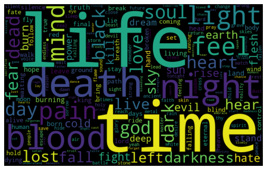


### By genre


```python
word_freqs = get_wordcloud_frequencies(corpus, tfidf=True, min_df=40)
for i, genre in enumerate(genres):
    print(genre)
    word_cloud = WordCloud(width=800, height=500).fit_words(word_freqs[i])
    plt.figure(figsize=(8, 5))
    plt.imshow(word_cloud)
    plt.axis('off')
    plt.show()
```

    creating dictionary
    generating bag-of-words representation
    filtering words
    generating TF-IDF model
    generating frequency dictionaries for WordCloud
    black
    


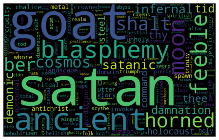


    death
    


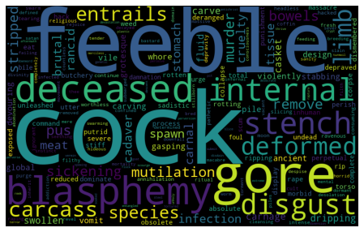


    deathcore
    


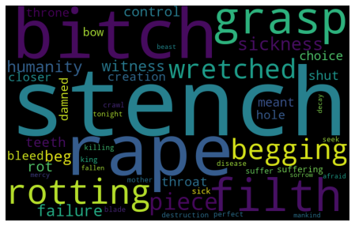


    doom
    


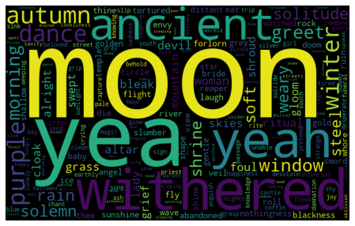


    folk
    


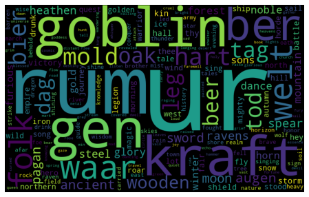


    gothic
    


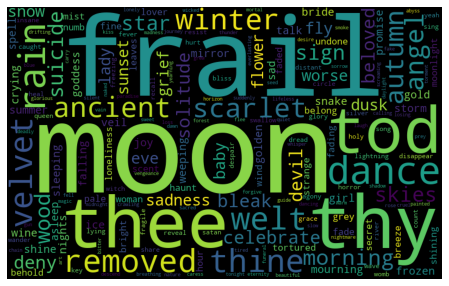


    grindcore
    


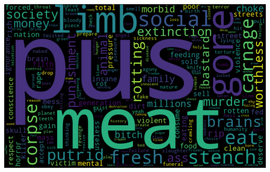


    heavy
    


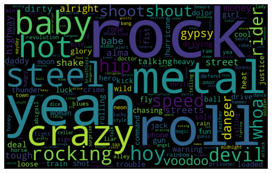


    metalcore
    


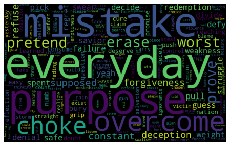


    power
    


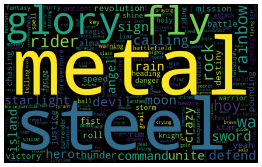


    progressive
    


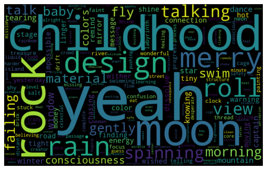


    symphonic
    


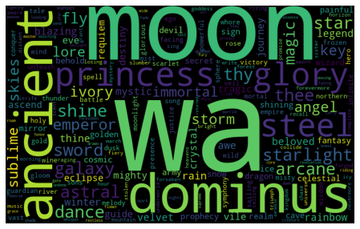


    thrash
    


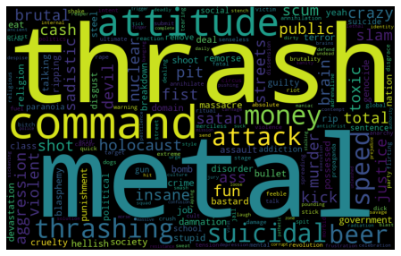

